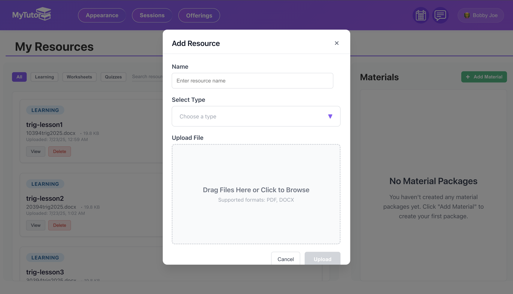

# MyTutor Platform

## Overview
MyTutor is a modern, full-stack tutoring platform designed to connect students and tutors for live, interactive learning sessions. The project is hosted on Azure and features a robust backend and a dynamic frontend, both built for scalability and ease of use.

## Features
- **Live Video Sessions:** Real-time video calls between students and tutors, with integrated chat and resource sharing.
- **Session History:** Students and tutors can review past sessions, feedback, and materials.
- **Materials Management:** Only materials assigned to a specific offering or lesson are available during a session.
- **Authentication:** OTP-based login for secure, passwordless access.
- **Payments:** Stripe integration enables merchant tutors to receive payments from students for lessons.
- **AI-Powered Tools:**
  - Utilizes LangChain, Chroma vector DB, and Retrieval-Augmented Generation (RAG) to generate quizzes for tutors based on their uploaded learning resources.
  - The same stack is used to transcribe video call audio to text and automatically identify key feedback points for students to improve on.
- **Caching:** APACHE Kafka, Elasticsearch, and Redis-backed caching for fast search and data retrieval (chat-logs, searching marketplace, session data).
  
## Tech Stack
- **Frontend:** Angular (standalone components, SCSS, RxJS)
- **Backend:** Ruby on Rails, GraphQL API, ActiveRecord, Redis, APACHE Kafka, Elasticsearch
- **Database:** MySQL (UUID primary keys, JSON columns)
- **AI/ML:** LangChain, Chroma vector DB, RAG
- **Payments:** Stripe
- **Hosting:** Azure

> Note: Backend and frontend are not currently hosted (taken down due to cost). For inquiries or access, please reach out to me.

## Demo Folder
All demo videos and walkthroughs are available at:
https://loom.com/share/folder/da3e97a27a884e93a8658cdd61855d53

## Demo Screenshots
homepage

AI generated quiz resource for tutors

AI generated post-session student feedback

purchase lessons

upcoming sessions calender

lesson marketplace

tutoring video call

viewing other users' profiles

user profile settings

messenger chat feature

stripe payment settings

stripe payment methods

stripe tutoring checkout

tutor adding resource files

AI Quiz Generation

tutor resource file manager

tutor scheduling class times

tutor adding new lessons

session history menu

OTP user signup

tutor lesson marketplace

user guide page

lesson purchasing menu

user calender upcoming sessions

selecting time slots to purchase

user OTP signup types

user OTP login

main menu page

blank chat menu

## Contact
For questions, demo access, or collaboration opportunities, please reach out to me. 
